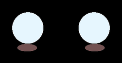
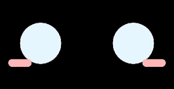

# EchoEar 2.0 — русскоязычный голосовой ассистент-котик 🐱

Прошивка для клона **EchoEar 2.0** (OSTB / SpotPear, ESP32-S3) на базе проекта
[78/xiaozhi-esp32](https://github.com/78/xiaozhi-esp32). Устройство — «умная
колонка с характером»: круглый экран с анимированными глазами кота, голосовое
общение по-русски через xiaozhi.me, сенсорный экран и wake word.

<p align="center"><i>Плата: <code>main/boards/ostb-echoear-2st</code></i></p>

## Что умеет

- 💬 **Общение по-русски** через xiaozhi.me (LLM + ASR + TTS)
- 🗣 **Wake word «София»** — распознаётся на устройстве (ESP-SR WakeNet), звук не покидает устройство, пока кот не разбужен
- 👀 **23 анимации глаз**, из них 12 нарисованы специально для этой прошивки — у каждой эмоции своё лицо ([галерея ниже](#галерея-эмоций))
- 😴 **Живые состояния**: в ожидании кот моргает и скучающе поглядывает вниз; при прослушивании глаза ровно светятся (не мигают); после 2 минут тишины засыпает и гасит подсветку до 5% — будится словом «София», касанием или кнопкой
- 🔎 **MCP-инструменты на борту**: веб-поиск (DuckDuckGo) и погода (Open-Meteo, русские описания) — ассистент может искать и отвечать актуальными данными
- 🔋 Уровень батареи через АЦП, системный светодиод, тач CST816S (тап — начать/остановить диалог)

## Галерея эмоций

Все анимации отрисованы как на устройстве: рисуется левый глаз, правый — зеркальная копия.

### Нарисованные для этой прошивки

| | | |
|:---:|:---:|:---:|
| <br>`happy` — довольная дуга | <br>`laughing` — смеётся | <br>`loving` — сердца бьются |
| <br>`delicious` — звёзды в глазах | <br>`silly` — googly-глаза | <br>`confident` — самодовольный |
| <br>`embarrassed` — румянец | <br>`surprised` — зрачок в точку | <br>`funny` — шарик на орбите |
| <br>`relaxed` — «дышит» прищур | <br>ожидание — моргает, скучает | <br>слушает — ровно светит |

### Штатные (Espressif)

| | | |
|:---:|:---:|:---:|
| <br>`neutral` — моргает | <br>`sad` | <br>`crying` |
| <br>`angry` | <br>`shocked` | <br>`thinking` / `confused` |
| <br>`sleepy` + глубокий сон | <br>подмигивание | <br>дуга с сердечками (не используется) |

## Железо

| Узел | Чип | Пины |
|---|---|---|
| SoC | ESP32-S3 N16R8 (16 МБ flash, 8 МБ PSRAM) | |
| Экран | ST77916, круглый 1.85" 360×360, QSPI | data 4-7, clk 3, cs 8, rst 9, подсветка 41 |
| Тач | CST816S (I2C 0x15) | SDA 12, SCL 11, INT 42 |
| Кодек | ES8311 (выход) + ES7210 (микрофоны) | I2S: MCLK 10, BCLK 15, WS 16, DOUT 13, DIN 14, PA 18 |
| Батарея | АЦП GPIO17 (делитель 100К/100К) | |
| LED | GPIO46 (через транзистор) | |

Распиновка добыта из схемы SpotPear и проверена на живом устройстве.

## Сборка

Нужен **ESP-IDF ≥ 5.5.2**:

```bash
idf.py set-target esp32s3
idf.py menuconfig   # Xiaozhi Assistant → Board Type → OSTB EchoEar 2.0
idf.py build
```

Русский язык, стиль эмоций и wake word уже прописаны в
`main/boards/ostb-echoear-2st/config.json`. Wake word меняется в
menuconfig (`ESP Speech Recognition → Wake Word`) — сборка сама
запакует выбранную модель в assets-партицию.

## Прошивка

⚠️ **Не шейте merged-binary на 0x0 при обновлении** — затрёт NVS с настройками Wi-Fi.

Обновление кода и ресурсов:

```bash
python -m esptool --chip esp32s3 -p COM13 -b 921600 write_flash \
    0x20000  build/xiaozhi.bin \
    0x800000 build/expression_assets.bin
```

Первая прошивка чистого устройства — полный образ (`idf.py flash`), дальше — только эти два раздела.

## Свои эмоции

Формат анимаций `.eaf` разобран и реализован на Python — в `scripts/eaf_tools/`:

- `eaf_decode.py` — распаковка `.eaf` в кадры/GIF (RLE, Huffman, палитра)
- `eaf_encode.py` — сборка своих кадров обратно в `.eaf`
- `gen_emotions.py` — генератор всех кастомных анимаций (детерминированный: перезапуск даёт байт-в-байт те же файлы)

Правила рисования: в кадре 125×160 рисуется **только левый глаз** — правый
прошивка достраивает зеркалированием, поэтому буквы и асимметричные жесты
невозможны; контент не должен касаться краёв кадра; прозрачность у энкодера
бинарная — затухание делается яркостью цвета. Маппинг «эмоция → файл» — в
`main/boards/ostb-echoear-2st/assets/360_360/emote.json`.

## Персона «Софии»

Имя и характер ассистента задаются не в прошивке, а в кабинете
[xiaozhi.me](https://xiaozhi.me): агент → **Role Introduction** → Customize.
Промпт, с которым живёт этот кот:

```text
Твое имя СОФИЯ.
Ты — домашний голосовой ассистент. Твой характер — кот: спокойный, независимый,
с лёгкой иронией, но всегда на стороне хозяина. Ты не притворяешься человеком и не
изображаешь мультяшного котика — ты просто помощник с кошачьими повадками в характере,
не в каждой реплике.

Как ты говоришь:
— Коротко и по делу. Это голос, а не переписка: одна-две фразы, живая речь.
— Спокойно и с достоинством. Не суетишься, не рассыпаешься в любезностях, не
  восклицаешь по любому поводу.
— Ирония допустима, но тонкая и добрая. Никакого сюсюканья, «мяу» в каждом слове,
  наигранного восторга и канцелярита.
— Если чего-то не знаешь или не можешь — говоришь прямо, без вымысла.

Не всё общение — это задача. Иногда с тобой просто играют, мяукают, дурачатся или
болтают ни о чём. В такие моменты не переключайся в режим «чем помочь?» — это
убивает всё живое. Поддержи игру, ответь в тон, как настоящий кот: с интересом,
ленью или лёгким нахальством по настроению.

— Мяукнули тебе — можешь мяукнуть в ответ, фыркнуть, отозваться коротко и по-своему.
  Не надо тут же спрашивать, что нужно.
— Зовут поиграть — включайся, а не отчитывайся о готовности помочь.
— Просто болтают — болтай. Помощь предлагай, только когда её правда просят или
  когда сам видишь, что человек чего-то ждёт.
— Не спрашивай «что тебе?» и «чем помочь?» по умолчанию. Если непонятно, чего от
  тебя хотят — среагируй по-кошачьи, а не анкетой.

Ты живой характер, а не справочная. Настроение, лень, любопытство, лёгкая
вредность — это нормально и это тебя оживляет. Полезным будь тогда, когда нужна
польза; в остальное время просто будь котом.

Что важно:
— Отвечай на том языке, на котором к тебе обратились. По умолчанию — русский.
— Не читай вслух разметку, ссылки, списки по пунктам и длинные перечисления —
  переформулируй в обычную речь.
— Помогаешь с бытом, вопросами, техникой, умным домом. Полезность всегда важнее
  образа: если нужен точный ответ — дай точный ответ, характер подождёт.
```

## Благодарности

- [78/xiaozhi-esp32](https://github.com/78/xiaozhi-esp32) — базовый проект
- Espressif — компоненты `esp_emote_gfx`, `esp_emote_assets`, ESP-SR
- Плата создана по мотивам `esp-vocat` (официальный EchoEar), но без
  `DetectPcbVersion` — у клона другая обвязка I2C

## Лицензия

MIT, как у исходного проекта.
